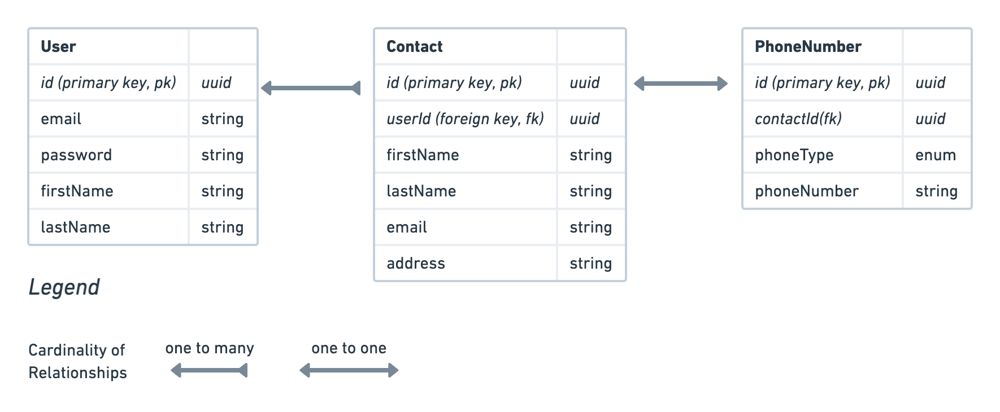

## Entity Relationship Diagram

## Endpoints:

**POST /users**

Request body: { email, password, firstName, lastName }

Response: { token, email, firstName, lastName, message: "Account successfully created." }

**POST /login**

Request body: { email, password }

Response: {token}

**POST /users/:userId/contacts**

Request body: { firstName, lastName(optional), email(optional), address(optional), phoneType, phoneNumber }

Request params: userId

Authorization header: Bearer token

Response: { firstName, lastName, email, address, phoneType, phoneNumber message: “Contact successfully created." }

**GET /users/:userId/contacts**

Request params: userId

Request query params: limit(optional), offset(optional), sortBy(optional. Values can be either “alphabetically” or “recent”)

Authorization header: Bearer token

Response: sorted & paginated contact list based on the input in the query params

**PATCH /users/:userId/contacts/:contactId**

Request params: userId, contactId

Request body: { firstName(optional), lastName(optional), email(optional), address(optional), phoneType(optional), phoneNumber(optional) } - at least 1 needs to be present to be successful

Authorization header: Bearer token

Response: { updatedContact, updatedPhoneNumber }

**DELETE /users/:userId/contacts/:contactId**

Request params: userId, contactId

Authorization header: Bearer token

Response: 204 { message: "Contact deleted." }

## Reasoning behind technical choices

#### **End to end vs unit/integration tests**

We can test the whole system with relatively few tests by using E2E. E2E tests take comparatively long to run but with the time constant make much more sense to write. If the app becomes bigger, we should consider adding unit/integration tests.

#### **Signup&login**

Even though not part of the original specs, I decided to implement them. If the app is to be production ready we would need them.

#### **Database**

Have a separate table for the phone numbers. We can add more types of phone numbers in the future. For now, each contact can have only one phone number but the current setup makes it easy to scale and refactor when needed.

## What I would have done differently given more time:

#### **Input validation**

With the current setup there is some basic validation in the models. With more time I would have used a library like yup or joi. For example, updating createdAt and updatedAt is currently possible.

#### **Make separate branches for each feature**

With the time constraint, I prioritised other things.

#### **Relational vs non relational database**

The assignment would have been a good use case for a non relational database. Because of the time, I decided to stick with what I know best and used Sequelize ORM.

#### **Access control**

Might have been good use case for a library but I decided to implement middleware because I know how and already had code I could reuse.

#### **Contact - PhoneNumber tables relationship**

The setup would have been ideal for a 1-to-many relationship where each contact can have multiple phone numbers associated with it. That was my initial idea. For an MVP, having only one phone number per contact should be fine but this is definitely something I would have worked more on, given more time.

#### **Queries**

Certain endpoints have way too many queries for my liking (for example the PATCH one). Given more time I would have refactored them to improve performance.

#### **Tokens**

Implemented 1 token only that expires after 90 mins. With more time I could have implemented an Access & Refresh tokens.

#### **Seeders**

Would have added seeders for better performance testing if I had more time.

#### **Tests**

I would have put way more “unhappy” path tests if given more time.

#### **Additional endpoints**

I would have added a delete for User and associated tables.

## Template code:

`npx sequelize init` Initiates models, migrations, seeders and config folders

`npx sequelize model:generate`
Creates very basic templates for the specified model & migration which I then amended with further input validation, scopes and associations.

I reused code from other projects in:

/src/middlewares/authenticateToken.js

/src/middlewares/userVerification.js

/src/utils/generateToken.js

/config/config.js

/index.js

/app.js (signup, login, and partially GET & DELETE contacts)

/src/tests/app.test.js (signup, login, and partially GET & DELETE contacts)
